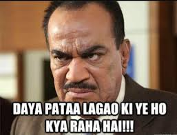

In the [last probe](https://dkprobes.tech/Data-Structures/paren-check), we did a quick deep dive into our array with an attitude, aka stack, and solved a standard problem on it. Today, we test our understanding of stack a little more, talking about another standard problem : 

> Convert an infix operation to postfix

Step 1 : 



Remember the good old days, when math was the toughest thing that could go wrong? You might remember something like, evaluate : (A + B)*(C-D). That’s, normal, no? You have two numbers, and an expression in between. You perform the expression on the two numbers, aka operands.

Now, oversmart as they are, a bunch of mathematicians thought, “Hmm. Why don’t we make life tough? And introduced prefix and postfix notations. “ 

Well, tbh, that wasn’t the actual motive. We, humans, can understand brackets and BODMAS. (I am assuming.). It’s hard for a computer.

Consider an expression : A*(B-C). BODMAS rule dictates that we first need to evaluate the expression inside the parens, and multiply that value to A. For a computer, it starts evaluating, gets A, goes to A*, then it realizes, “Ah, shit. Here’s something I ought to have done before“, does some abracadabra to make sure it doesn’t forget the A*, evaluates B-C, then comes back to A*.


Instead, the expression in pre/postfix is easier for the computer to evaluate. 

What does that mean?

The expression (A + B)*(C-D), in prefix looks like : *+AB-CD and in postfix : AB+CD-*

If you look carefully enough, in prefix, the operation is carried BEFORE the operands;

A + B become +AB, and for postfix, the other way round, A + B becomes AB+. 

The above expression, (A + B)*(C - D), is converted by breaking it into parts : We first convert the bracketed expressions into postfix : A + B becomes AB+, and C - D becomes CD-. Now, (AB+) and (CD-) are operands, with the operator *.

So, the final operation becomes (AB+)(CD-)* == AB+CD-*

Now, I have strongly believed

> If there’s a problem worth solving, and you have some caffeine, you can solve it using programming.

So, let’s see if we can devise an algo to convert an infix exp to a postfix exp. 

To start, observe that we are NOT changing the relative order of the operands AT ALL. A + B becomes AB+. A will always come before B.

So, while going through the infix expression, if we encounter numbers(operands), we’ll just append them to our final expression. The operations will change places a little.

We then have to set the precedence of operators, meaning, power would be evaluated first, then multi/div, then add/sub(BODMAS rule).


Now, the final question : What do we do with the brackets and the operator order? 

Note, when brackets start, it’s not really a big deal. When brackets end, 


because, as brackets end, we have a sub-expression, that we have to push into our final answer.

Finally, if it’s an operator, we’d have to figure out the operands which it’s supposed to operate on, and take care of the precedence.

Now, it might not be VERY intuitive to you, right now, but let’s see how that looks in code.
```
#include<bits/stdc++.h> 
using namespace std; 

//Function to return precedence of operators 
int prec(char c) 
{ 
	if(c == '^') 
	return 3; 
	else if(c == '*' || c == '/') 
	return 2; 
	else if(c == '+' || c == '-') 
	return 1; 
	else
	return -1; 
} 

// The main function to convert infix expression 
//to postfix expression 
string infixToPostfix(string s) 
{ 
	stack<char> st; 
	int l = s.length(); 
	string ns; 
	for(int i = 0; i < l; i++) 
	{ 
		// If the scanned character is an operand, add it to output string. 
		if((s[i] >= 'a' && s[i] <= 'z')||(s[i] >= 'A' && s[i] <= 'Z')) 
		ns+=s[i]; 

		// If the scanned character is an ‘(‘, push it to the stack. 
		else if(s[i] == '(') 
		
		st.push('('); 
		
		// If the scanned character is an ‘)’, pop and to output string from the stack 
		// until an ‘(‘ is encountered. 
		else if(s[i] == ')') 
		{ 
			while(!st.empty() && st.top() != '(') 
			{ 
				char c = st.top(); 
				st.pop(); 
				ns += c; 
			} 
			if(st.top() == '(') 
			{ 
				char c = st.top(); 
				st.pop(); 
			} 
		} 
		
		//If an operator is scanned 
		else{ 
			while(!st.empty() && prec(s[i]) <= prec(st.top())) 
			{ 
				char c = st.top(); 
				st.pop(); 
				ns += c; 
			} 
			st.push(s[i]); 
		} 

	} 
	//Pop all the remaining elements from the stack 
	while(!st.empty()) 
	{ 
		char c = st.top(); 
		st.pop(); 
		ns += c; 
	} 
	
	return ns;

} 
```


The prec function is no impossibility to gobble : It just sets the precedence. Also, if we have an operand, we just push it into our final answer.

If it’s a closing bracket, we have one complete subexpression, which we concat into our final anwer.

ANNDDD

If it’s an operator, 

we have to look for the operands we want to operate on. To do that, we go popping from the stack, UNTIL the precedence of the top is more than the precedence of the present operator. To understand that,

ABC*+ -> A + B*C and ABC+* -> A*(B+C)

For the first one(ABC*+), the precedence of the + is LESS than that of the previous operator(*), that means that we pop, thus meaning that + happens between the ANSWER of B*C and A. 

For the second(ABC+*), the precedence of * is more than +, and that means, the plus happens BEFORE.

We end when we reach the end of the stack. 

Now, WASN’T THAT SIMPLY MINDBLOWING?

I’d want you to take a minute to appreciate the stack data structure here. Because we used top and push and pop, we could very easily keep ourselves on track with where we were at. 

Had it been an array, we’d have to do the referencing through indices. Instead of top, we’d have to have a[n-1], instead of pop, we’d have to actually delete the element and update the value of n. Vector would make it complex, and array, close to impossible.

That’d have been disastrous.

So, we have to thank the stack for that.

This, is just one of the many inter-conversions possible, but I hope you got the idea of how we go about it.

You can try working out the reverse(Post to In), or (In to Pre), and let me know if you have some luck. In the next probe, we’ll be taking up a slight extension of the same problem. [GeeksforGeeks link](https://www.geeksforgeeks.org/postfix-to-infix/)

To get these posts via mail, subscribe [here](https://dkprobescode.substack.com/subscribe)

