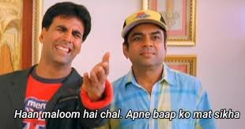

Henlo peeps!

Apologies for the one day delay. Had a particularly nasty presentation yesterday, so, hope you understand me.

The last posts talked about sorting. You can check them out here.

Today, we talk about a VERY important class of problems, all being some variation of a common algorithm, called Kadane’s, a Dynamic Programming approach.

What most of us feel when we hear Dynamic Programming.


It’s hard AF. But let’s try and make sense of it, one problem at a time.

To understand it, we’ll take the problem, “Largest contiguous subarray sum“. Here’s what it looks like

> Given an array, find the subarray, which has the largest sum.

Before we delve into the logic, a lot of students, including me, are usually confused between a subarray, subsequence and subset. Now, most good question setters in the world make it a point to explain what they mean when they formulate the question, but assuming that the question setter isn’t a good person, here’s a widely accepted interpretation.

Subarray : Contiguous(continuous)sequence

A = [1, 2, 3, 4]

[1, 2] is a subarray, [1] is a subarray. [1, 3] is NOT a subarray.

Subsequence : May be non-contiguous, but the elements have to be in the SAME sequence as they occur in the array.

Thus, [1, 3] is a subsequence, in the above example. So is [1,4], so is [1,2]. But [2,1] is NOT.

Oh, and all subarrays are subsequences. 

Subset : is a subset. Can have 0 or all elements. No order requirement.


———————————————————————-

So now, to our question. We have to look through all subarrays, and find the one with the largest sum.

There are two Naive approaches for this, and the first one is SO naive, that I want to call it stupid.

Approach 1 : We have to pick subarrays, right? Subarrays can be of sizes from 1, to the size of the array. So, we take two iterators, both initially pointing to index 0. We move one of the pointers one place at a time, each forming a subarray starting at index 0 and ending at the position of the second pointer. Once the second pointer reaches the end of the array, we move the first pointer by 1, and bring the second pointer back to the position of the first, and repeat the process. To give you an example

[1,2,3,4] -> [1], [1, 2], [1, 2, 3], [1, 2, 3, 4], [2], [2, 3]….

So, we got a trick to make the subarrays, albeit not a very good one. How do we find out the sums? Although some of you might have tubelights going off as to a better approach, let’s try and behave a little stupid.

For every subarray, we’ll go about calculating the sum RIGHT from the beginning, everytime we add an element. For this, we take a THIRD pointer, that will traverse through the subarray, and add up all elements.

For instance, [1] sum = 1

[1, 2] => 1 + 2

[1, 2, 3] => 1 + 2 + 3….

Well….


Indeed, this is a very stupid approach. The time complexity is O(N^3), which is slower than anything we’ve seen so far in any of our posts. 

An optimization is immediately apparent. We don’t have to use the third pointer to find the sum. For instance, if we’re already calculating [1,2] => 3, there’s no point in calculating it again when you’re calculating [1, 2, 3].

That, my friend, is the very beginning of the concept of the much dreaded dynamic programming. Although we won’t be going into the whole intuition behind DP, you get the idea of not re-doing problems.

So, there’s this optimization, where we just store the sum from the previous subarray, into a variable, and add the next element to it. We update this sum when we encounter a sum greater than the present max, and we’re done.

No, it’s not good enough. 

Here comes Kadane’s algo.

We move through the array.

At every element, we do two things. One, we find the LARGEST SUM OF THE SUBARRAYS ending at that element. And two, we find out if this sum is better than the overall existing largest SUM. If so, we update the overall existing largest SUM.

For instance, 

[-2, 1, -3, 4]

Step 1->[-2] is the only subarray. And it’ll also be the overall maximum sum so far.

Step 2->There are two subarrays that end at 1. 1 itself, and [-2, 1]. The larger sum of the two is for the subarray [1]. So, we keep that in hand. We now compare it to the overall maximum sum so far, which is -2. 1 > -2, so we update the overall largest sum.

Step 3-> max(ans(step 2) + -3 , -3) and so on.

So, we need two variables. One to hold the max sum, and another to iterate through the array. For every element, we find the MAXIMUM sum of all subarrays ending at this array, and compare it to the MAXIMUM sum SO FAR. 

```
int largeContigousSubarraySum(vector<int>a)
{
	int maxSum = a[0];
  	int maxEndingHere = a[0];
  	
  	for(int i = 1; i < a.size(); i++)
    {
    	maxEndingHere = max(a[i], maxEndingHere + a[i]);
      	maxSum = max(maxEndingHere, maxSum);
    }
  	return maxSum;
}
```

Time complexity? No brainer there. We’re looping through the array just once, so it’s O(N). Space? Again, no extra data structure used, so O(N).

One small point of consideration is, why started with maxSum AND maxEndingHere as a[0] and NOT 0. That’s for the case when all array elements are negative. Had we taken them to be 0, it’d have given our answer as 0, when there’s NO WAY a sum of 0 could be formed when all elements are negative.

Finally, why’s this called Dynamic Programming? For calculating the max sum, we didn’t go about RECALCULATING the sums from the beginning, rather, we just ADDED the present element to the max so far. That’s DP. You don’t repeat the stuff you already know. 

For people who’ve seen Kadane, and the approach given on GeeksforGeeks or such like, you’ll notice that they had one intermediate step in between, wherein, they use an EXTRA array to store the MAX SUMS at each ending element. And that’s actually how DP works, storing all previous results. But for our case, we DON’T need to know ALL previous ones. We just need the MAXIMUM one. So, we just use a variable(maxSum) instead of a whole array. Plus, we haven’t introduced DP formally in the posts yet, so we’ll introduce this approach in a later post.

If you’re feeling like this right now,


then I’d say,

Just try reading through the whole thing over again, and try to dry run it through an example. As said before, Kadane’s algorithm is used in a number of standard problems, and here we have seen one. There’s more in the coming posts.

To get these posts via mail, subscribe [here](https://dkprobescode.substack.com/subscribe). You can follow me on [LinkedIn](https://linkedin.com/in/dkp1903), [GitHub](https://github.com/dkp1903) and [Twitter](https://twitter.com/dkp1903).

Until next time

DKP

ITUS(International Talent of Ultimate Student)