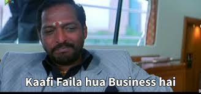
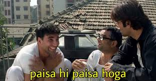

Last week, we completed our heart-wrenching saga of the catastrophic downfall of WeWork. Oh, and by the way, if you still haven't had enough. As per a report that came out just a few days ago, WeWork is now valued at $2.9 Billion. Remember back in the day? 

96 Bil -> 47 Bil -> 20 Bil -> 8 Bil, and now, not even 3??

I hope you realize the extent of the catastrophe. And the funny part? Here's a quick concept : 

> Concept : A company's valuation is based on how much investors are willing to pay for a chunk of the 
> company. It's not actual dollar bills, but just estimates on paper.

And from the last talk, who was the largest investor in WeWork? Softbank. This latest downturn of valuation came after Softbank refused to buy shares.

And how much is each share worth ? $4.

That's it. I get it. It's way too much of WeWorking. Let's move on.

Let's talk Uber.

Unlike WeWork, I don't have to give you a prologue about what Uber is. Because, well, it's just way too ubiquitous.

Yes, that. Thanks, Nana.

> Concept : We can divide consumer markets by demography and concentration, specific to the market structure 
> and the consumers, and we can divide Uber's market into these 5: 

1. US

2. China

3. India

4. South East Asia(mainly Indonesia)

5. Brazil

You can, at once, see why these were picked : The most populous countries/regions on Earth. Thus, the largest population that needs to be on the move.

Now, at a point of time, Uber was among the top two players in ALLLLLLLLLL of these markets, and it was well deserved. Uber started at a very very opportune moment : 2008 - The world reeling under the real estate bust, gave rise to  investors falling overthemselves to bid their bets onto technology, coupled with Apple launching iPhone(2007) and Google, Android(2008). All of this signified that a tech revolution was in the works, and Kalanick, founder of Uber, was quick to capitalize on that, with a unique business model.

> Concept : A business model talks is a summary of a company's structure - its shareholders, revenue streams, 
> customer bases, the value for its customers, channels, marketing strategies, expansion plans etc.

Few people know this, but Uber is NOT a taxi company, as you might have expected. They called it a TECH company. 

Now, the people who read the WeWork story might be feeling : 

For those who haven't, WeWork was an office-rental company, but just happened to call it a tech company, and SINCE it called itself a tech company, it could bring billions of dollars in investment, which would otherwise not have come, and you wouldn't have had the misfortune to read the gut-wrenching story.

Now, Uber, another company that doesn't LOOK like a tech company, is calling itself a tech company. And it seems, unlike WeWork, their business model supported their stance : 

> Uber's business model wasn't owning cars at all. It was just a bridge between drivers and riders. It would
> use technology to optimize the process, aka, using location services to optimize driver routes, reducing
> wait time using the app and others. 

And to prove its point, Uber had ZERO cars under its ownership, and called its drivers 'INDEPENDENT CONTRACTORS', not EMPLOYEES. That meant that the drivers were only using Uber as a service, and were paying for the extra passengers and optimized service they got, by letting Uber take a chunk of the fare(~25%). But, this also meant, that they were foregoing all benefits that employees would get, like severance, health benefits, pay protection and more. In fact, if you're reading the news lately, you must have heard of a lawsuit between the drivers and Uber in California, where drivers are demanding to be called 'employees', and Uber doesn't want to.

And, cutting itself free of having to support its drivers through benefits was just one part of Uber's plan to not call itself a taxi company. The other pain point was : The government wasn't very fond of Uber.

All the legal wordplay aside, Uber took people from point A to point B. That's what the subway and the yellow taxis did in the US, and that's what autos, city buses, metros and BRT services do in India. And by charging prices lower than the taxi/auto drivers, Uber was killing off competition. Not only were auto-walas complaining of lost livelihood, the government revenue was directly affected : Public transport fees form a major part of govt revenue. And that's not all : In its effort to expand aggressively, Uber cut corners along some environmental regulatory norms. All of this, coupled with the fact that a company that's driving taxis, but isn't calling itself a taxi company, and thus, operates without a license, enraged the government into multiple investigations into Uber. 

There, again, Kalanick had a work-around, one that he'd outlined in an early path-to-profitability ideal in the business model : Create such a strong demand for the rides, among the people, that the government would have no choice, but to cave in.

Now, how do you encourage people to ride around in taxis more? Make it cheap, and capture the market with big time aggression. And that's what he did. Another part of Uber's business model, one that was also seen in WeWork, and is seen in most new age startups : Be bloodthirsty. And if you're making it cheap, means you're losing a shit ton of money. And who pays for all of it? 

You guessed it right.

The investors.

Foregoing profits to earn market share. This ideal was being used for Uber too. 

And how exactly did it 'forego profits'? 

- Keep ride fares cheap

- Give out promotional discounts

- Give a BIGGG chunk to onboard drivers

- Aggressive marketing

It did all of this. You must remember the number of discount offers you got from Uber around 2015, if you were alive and well then.

While Uber did all of this, it KNEW that it wasn't going to work in the long term. 

> Investors are looking for an exit, and to make an exit, they have to make money. In fact, they expect the 
> founder to make them money. And thus, a company can lose cash only to a limit.

So, one of Uber's plans to go profitable was by aiming to cut off its biggest cost : Drivers. 

You are a taxi company, but you don't have people driving the car?! How does that work??

I don't have 'people' driving the cars. I have robots driving the cars.

Correct. Self-driving cars. Uber planned to slowly replace drivers by self driving cars. And robots don't ask for a chunk of the fees, so, all of your fare's going to Uber's pockets. 

Sweet, ain't it?

Finally, one of my favorites from their strategy : Expansion plans

Uber even thought BEYOND world domination, and that is saying something. Even the imperialists didn't think that big :/ (Excuse the very biased pun)

Uber aimed to diversify their product line. In other words, go beyond ride sharing. In other words, Uber had ideas of something like Uber Eats, or Uber helicopter or Uber X well before it was launched. That's vision for you.

And that's not all. Kalanick also hinted, that the profits from these extensions, would be funnelled into the ride sharing business. Why that is particularly interesting? Was Kalanick aware, that the ride sharing business might not be profitable?

In case you haven't realized it, you just completed a small tutorial on what is a business model, taking the case study of Uber. So, if you want to gift me the Presidential Medal of Honor or something, feel free.

This business model was pretty sweet, all aspects of it hinting at first, a breakneck growth, and then

Well, fast forward to today : Uber faces breakneck competition from Lyft in the US, Ola in India, DiDi in China, Grab in South East Asia and DiDi owned 99 in Brazil. 

And, what's more? Uber has been on since 12 years now, and it is yet to see a profit. 

There go all the hopes of world domination and a truckload of cash. 

And how it all came about, is a question of business model robustness, and how markets usurp the balance, a rather delicious concept we'll look into in the next post.

To get these posts via mail, subscribe [here](https://dkprobesmarket.substack.com/subscribe). Also, I'd love to receive any feedback from you regarding what you'd like to read about, so please do reach out to me on [LinkedIn](https://linkedin.com/in/dkp1903), [Telegram](https://t.me/dkp1903), [Twitter](https://twitter.com/dkp1903).