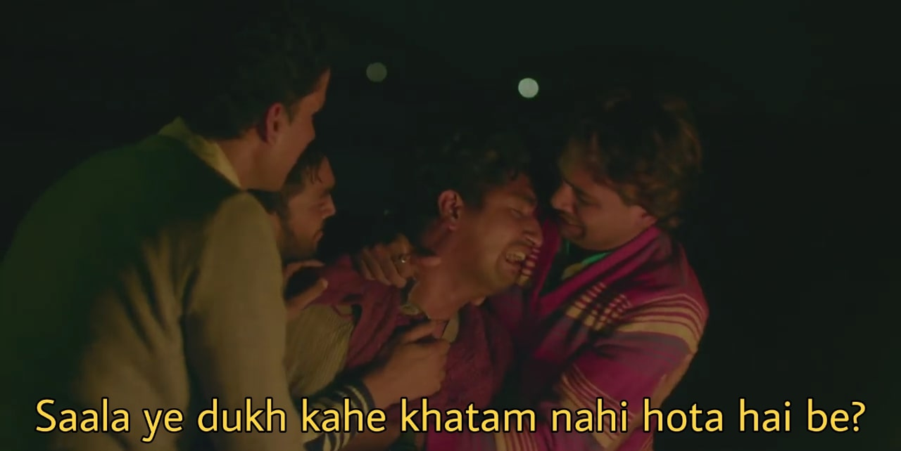
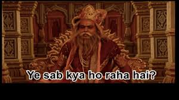
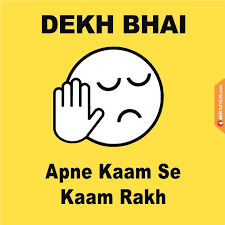
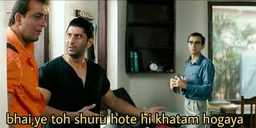
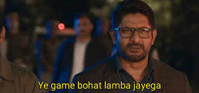
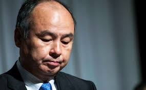

It's been a while since we last interacted through our [introduction to Uber](https://dkprobes.tech/Markets/the-uber-story), where we'd discussed the concepts of a business model, through the case study of Uber, and how, in spite of the 6 highlighted points, Uber is yet to turn a profit.

Before we set off today, it's best that we know some happenings in Uber world over the last few days:

1. Uber has been allowed to continue operations in California, while treating its drivers as INDEPENDENT CONTRACTORS and NOT employees, until a vote to be held in November, where the people will decide whether they want to keep allowing this, or not. 

2. A group of past and present employees of Uber have filed a lawsuit against it for the decreased price of the RSUs(Restricted Stock Units) post IPO, while being taxed on the stock price that Uber IPO-ed at.

Let's see what these two mean in our present and last discussion.

1. Remember how Uber called itself a tech company and distanced itself from its drivers by calling them independent contractors? Some of you reached out to me saying they didn't understand why this was that big a deal. So, what if they're independent contractors? They still get 70-75% of the fare cut, right? That should be enough for them. 

Think of the pandemic situation, where any sane person would think twice before getting into a car with an unknown person. Uber rides had fallen down by ~80% at a time. Most drivers forced to stay home, that's as good as being furloughed. Because, no rides, no payment. HAD THEY been employees, they might be entitled to benefits, severance, financial support, and a host of other stuff. But, Uber very casually just said, "Sorry, you ain't employees. Can't pay you nothing."

Imagine being robbed of almost all your earnings almost overnight, and the company essentially disowning you. Believe me, that doesn't feel good.

2. In my [WeWork probe](https://dkprobes.tech/Markets/wework-3), I had written how startup employees are given salaries less than existing market rates, in the name of ESOP, aka stocks. Now, when they're sold these stocks, they come with TnCs. The employees can't sell the stocks until 6 months after the company has gone public. These are called Restricted Stock Units. That means, your profit/loss depends on how the market treats your company's stock. 

And for Uber, this wasn't pretty. Uber's IPO has been widely claimed to be a shameful let down. Its stock price has hardly ever over-reached the price at which it IPO-ed. In simple terms, you were given 10 shares, each worth $30. When you go out to sell them, no one's gonna buy them at a rate more than $20. You're losing $10 a share. And at this time you throwback to the time when your company's founder had high end claims of you being able to make thousands of dollars in profit since the IPO was gonna be a massive success, and it all turned out to be a fiasco. 

And that's not all.

A weird law says that the stocks would be taxed on the price that they were issued at, aka, the much higher IPO price, and NOT at the price at which they were sold. 

Meaning? You have to pay 30% of $30 as tax, even if your stock is worth only $20. 

Indeed. The employees weren't pleased. Hence, the lawsuit.

This brings us to the question : In spite of the bombastic claims made by the founder about Uber being a cash cow in the making, this stuff isn't supposed to happen, is it?

Well, not if you're looking at ride hailing. And especially, Uber. 

Let's see what went wrong.

1. Undifferentiated service : Cmon, it's taxis. There's not a lot of scope of novelty that you can bring here. For instance, if it were Netflix, you could've brought in more unique content to beat Prime, or better customization for Amazon. In ride hailing, there's little. Uber tried out a few things. It tried partnering with Spotify that'd directly turn on the user's favorite playlist in the ride she/he ordered. Novel idea, but it turns out, people were just bothered with going from point A to point B as fast and as cheap, and no one really cared if they liked the song in the car for a 10 min ride.

The small improvements brought in through AI, reducing wait time, shorter routes, well, it wasn't unique to Uber. Lyft did the same, so did Ola, so did DiDi, so did 99. A great thing's great only if you're the only one doing it.

2. Low customer and driver loyalty : As said in the previous points, customers really didn't care about the color of the car, or the motive of the company, which were the two major factors that separated Uber from its closest competitors. Customers just wanted to get to their destination fast and easy, and they picked whichever service allowed them to do it. 

Same for drivers, they went along whichever company gave them a better cut, sometimes signed up for both, Uber and Lyft(or any other competitor). There was no such thing as customer loyalty.

As opposed to this, brands like Nike have power of customer loyalty. A customer will stick to the brand, because he feels an attachment.

3. Limited Economies of scale : Remember E of S? The t-shirt example from above? Well, it doesn't work all that well with Uber. After all, Uber is not a factory that can increase productivity by increasing the number of machines. Economies of scale are limited only to wherein customers recommend their friends, and drivers recommend their fellow drivers. That's about it, and that's pretty limited too. Remember, Uber loses money per ride. And the lower customer acquisition and marketing costs had only limited success in improving this.

4. Weak Network effects : Network effects would have increased manifold when drivers were jubilant with the money they were making. 

They weren't. Even though Uber was losing money, the drivers weren't loaded with cash either. In order to draw customers, Uber itself took losses, and to partake some of the losses, limited driver cuts. Most drivers toiled 12 hours a day, and still didn't make enough to cross the average household pay. I'm not gonna recommend a service that burns me out without proper remuneration.

5. No recurring revenue/customer lock-in mechanism : Ahhhh, this is my favorite.

Netflix. Yearly subscription. Money's just taken out of your card every month unless you take the pain of cancelling. And the rich people, those who earn thousands a day, don't really bother if Netflix chunks out a meagre 500/- a month. This is called a subscription based model. The customer is 'locked-in', in the sense that once the month starts, the fee is deducted. Nothing you can do about it.

Now think Uber. You don't subscribe for a month of car rides. You just book a ride whenever you want one. And that means, Uber can't snatch away money from your account like Netflix. Money comes only when you actually take a ride. No customer 'lock-in'.

Uber tried 'Uber pass', analogous to passes used in Indian Railways and city buses, but it didn't work. Ride hailing was seen as a disjoint, on-requirement thing, and people didn't really want to commit a month to it. 

6. Intense price competition to attract riders : We’d talked about the competitors Uber fought against, in every continent : Lyft, Ola, Didi, Grab, 99. All of these people had just one plan : Lose a shit load of money until you kick your competitors out, or end up acquiring them, and then slash prices.

Just read that last line again. 

ALL of them did this. All of them were backed by investors who were prepared to lose a lot of money in the hope to gain market share. In fact, remember good old Chinese puppy-face from the WeWork story? Masayoshi Son, the CEO of Softbank? The guy who invests his millions on ‘eyes’?

This guy, invested in two competing companies in a lot of places, including Uber and its competitors in rides, like DiDi, or in food delivery. In fact, he was well known for it!

Doesn’t make sense, does it? Well, no one but Mr Son could make sense of it and the fact that this ‘strategy’ of his has been disastrously mis-proven, we’d best not talk about it at length.

So, there you have it. We had 6 reasons that showed that Uber might have been raking in profits by the millions, but we also have 6 reasons to show why that was a utopian vision that hasn’t come to light still.

And we haven’t even talked about three of the biggest setbacks Uber has ever had, even before COVID : 

1. The aggression of Uber - It is natural that startups have to be aggressive - in marketing, price wars, adding new features, and Uber is a seasoned player in this race. Its policy read, ‘Growth at all costs‘, and it went after that with blood - using its superior cash bowls to out-bleed its competitors - Competitors who were all localized, unlike Uber- which wanted global domination. It was a concept of a race to the bottom - the least possible prices, leveraging social unrest to promote itself, among others. In fact, Kalanick had his employees book Lyft rides - only to cancel them at the last moment, and then using this sub-optimal experience to brainwash drivers to switch sides.

Cases of harassment - Kalanick’s ousting from the helmsman post came after there were reports of sexual harassment at multiple levels in the company, and his failure to address the issues. It was so widespread, that it was almost customary. You can well imagine how gross that must have been.

Failed IPO - After the major fiasco with Kalanick, the new CEO, Khasrowshahi tried to put out the fire by rapidly changing company culture, firing the wrong-doers, and focused on strengthening its core business, all to seemingly no avail, as Uber’s public listing was a letdown, with its valuation going to 82.4 Bil, as opposed to its highest ever of 120 bil! And that’s not the worst part! With a stock price of $45 a stock at IPO now come DOWN to a meagre $33 apiece, the market simply refused to buy into Uber’s future. 

And finally, come COVID, that has grounded more than 80% of Uber’s rides. 

What does this mean for Uber? What happened with all the promises it made? What happened to Uber Eats? Is it ever going to be profitable? We’ll be having a word on that in our next probe.

To get these posts via mail, subscribe [here](https://dkprobesmarket.substack.com/subscribe)

DKP

ITUS(International Talent of Ultimate Student)