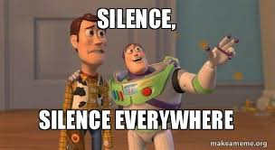

We’ve been talking about the Uber story for [two probes now](https://dkprobes.tech/Markets/the-uber-story), about how it’s (sort of) achieved its aim of global dominance, but it’s come at a cost, and some serious side stepping of laws that hasn’t exactly endeared it to either the government, or the primary stakeholders : the drivers.

Today, we try to figure out, if there’s a way Uber can salvage its operations out of misery, and what it might be forced to give up, for that.

Profitability is the first major concern. After all, if you’re a business, you can’t keep losing money forever. or you’re better off calling yourself Donald Trump

There’s 3 ways Uber can start treading the path to making a buck : 

1. Raise prices - To gain market share, aka kicking out the yellow cabbies and green and yellow autos, Uber had made that race to the bottom in terms of prices. Now that it has the market share, MAYBE, it could do its long expected aim of raising prices. 

Unfortunately, it isn’t gonna be very pretty. Remember we talked about lack of customer lock-in? The second Uber raises prices, customers are gonna go bye-bye Uber and welcome, Lyft, or Ola, or the others. In other words,

> The hugely assumed concept of being able to control market prices on gaining market share, has a very fatal > TnC : You should have a feature, that’d make sure your customers STICK, in spite of the much higher prices.

Jio, today, is so deeply entrenched in the Indian economy, with its good speed and seamless experience, that, should the company decide to raise prices, it wouldn’t be all that disastrous. 

Unfortunately, Uber ain’t that lucky.

2. Get a bigger cut off drivers : I can see a lot of you, readers, just immediately shaking your heads to this one. And you’re absolutely right. Uber is already mighty unpopular with the drivers, with its ‘INDEPENDENT CONTRACTOR’ ideologue, the very low fare prices and breakneck competition among drivers to get rides. Trying to up the cut is gonna aggravate the issue, and Uber can’t afford that.

3. Acquire : Remember the concept of traditional players buying off competition, aka, paying them to shut up? Uber could always do that : Shelling out a load of cash now, so that it wouldn’t have to worry about shelling out cash every ride. 

Unfortunately, Lyft doesn’t come cheap, or Ola. And how many companies are you gonna go about buying? The low barrier to entry concept - Remember? It wouldn’t be very difficult for a new entrant to make a ride hailing app and create a presence with investor money. Uber can’t go about buying all of em. 

These are approaches, that MIGHT NOT work. And this is old stuff - pre-COVID. I stress this, because if there was one company whose business model depends BIG on people moving to and fro, it was Uber. And now, people are just not moving to and fro.

> Public companies, such as Uber, have to release statements on their finances from time to time to the 
> public, and their financials are put up quarterly, that is, four times a year. 

Exactly a month ago, Uber released its Quarter 2 -2020 financial results.

And they were, well, surprising.

As expected, the ride hailing component was thwarted, with a 29% decrease in revenue from ride hailing, renamed Mobility. What was surprising, however, was a 103% increase in revenue from Eats, renamed Delivery! That’s more than double!

One potential source of misunderstanding for new entrants into the corporate world, including me, are the difference between revenue and profit. Revenue is total money raked in, not subtracting money that was going out, whereas profit is….profit.

Uber has billions in revenue, but it has no net profit. 

Remember one of Kalanick’s aims was to make Eats profitable, and use those profits to aid rides? Well, here is a potential chance to see that happen. 

After more than a decade, a deadly pandemic has made it possible.

However, Uber can’t rely on Eats alone to salvage the entire empire. While revenue is growing, Eats is still making losses and its market share is a shade of that of Rides. Doordash in the US and Zomato and Swiggy in Asia, as well as other players have posed serious competition, so much so that, earlier in January, they had to sell off Eats’ India division to Zomato and exit the market.

What’s finally gonna happen, you may ask? Uber has cash reserves to the tune of ~6 bil dollars, so, it’s not going bankrupt or something. At the rate it is going, it can pretty much keep going, and try small cost cuts and small profit increases here and there to try and lessen the losses. 

But, the problem is, while Khosrowshahi’s Uber is MARKEDLY different from Kalanick’s Uber, there’s one thing that hasn’t changed, and that is, their quest to dominate. And dominate big time.

Global GDP is estimated to be something to the tune of 85 tril dollars, give or take. Uber has three divisions : Mobility(Rides), Delivery(Eats) and Freight(transport of goods), and it estimates that the total market for all three of these, is ~15 tril dollars. 

Uber wants to dominate THIS market.  And we know, that Uber’s aim to ‘dominate’ hasn’t boded well with governments around the world.

Remember, Apple, one of the most valuable companies, has a total market cap of ~2 tril. And Apple is HUGELY profitable. With a LOT of money. Apple can buy out Disney right now WITH CASH, and it wouldn’t even flinch. 

Uber is far from that. But Uber has tall aims.

And for those tall aims, the present revenue model is, well, unsustainable.

Thus, we see that Uber’s story is reflective of the new structure of the markets today : 

> You could be making huge losses, but you could still dream big, and invest bigger.

In addition, Uber’s scandals have been sort of an eye opener for the power of the big corporates, with its aggressive strategies, its initial ways of bypassing government norms and its apparent money-losing machine. 

The aim of this probe, and its predecessors, was to help you understand what goes behind the company’s policies, and how companies with dominant market shares

Hope this probe gave you some insight on Uber, what lies behind the ride hailing behemoth, and what its strategies mean for economies around the world.

To get these posts via mail, [subscribe here](https://dkprobesmarket.substack.com/subscribe)

I am presently re-evaluating my strategy and structure of the probes, so as to ensure that its suited to your needs. For this, I’d request you to take a minute out, and let me know what stuff do you expect from me, and the manner in which you’d like it. [Here is a form](https://forms.gle/dupmJ559rz39eFUQ7) for the same. I’d request you to let me know, so that I can serve you better.

There won’t be a probe next week, as I plan to work on the structure. I’ll see you the week after

Until then

DKP

ITUS(International Talent of Ultimate Student)

