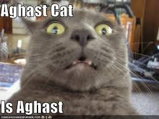

Hope you're here, shaken but alive, from my [previous post](https://dkprobes.tech/Markets/wework-2). If not, suggest you go through it to get the context.

I won't give you any more sleepless nights than I have with the antics of WeWork, so this is the last post of the series. It's longer, funnier and more shocking than the others, so brace yourselves, get yourself a cuppa and delve in.

We wrote 4 vomit-inducing things that Neumann did in the last post. As if those weren't enough

Neumann be like

5. Neumann's voting rights : A company is owned by a number of people, through stocks. Some stocks have voting rights, and some have just financial stake. Neumann SOLD financial stake in the company, in exchange for voting control, so much so, that his shares had voting right ratio of 20 : 1, meaning, if 19 of the board of directors of WeWork said 'A, B, C, D', Neumann could say 'B, C, D, A', and Neumann's authority would prevail. 

20

Of some of the richest, most influential people in the world.

And he gave up financial stake for this. Financial stake, of a company that hadn't seen a profit in 9 years. Brings up a very simple question : Was he just not interested in the money, or did he know, that there was no way WeWork was gonna turn a profit?

If you're still not convinved of Neumann's oddities, and his absolute control,

6. Rebekkah Neumann, Adam's wife, who was on the board, would have total right to choose Adam's successor. Again, no rights with the Board of directors. So, if Adam died, she could well position herself, any of her kids, or relatives, at the CEO's position, a position that had 20 : 1 voting rights, and thus, practically held the company's reigns. This was worse than autocracy : Not only did the Neumann family call the shots, their lack of financial stake also meant that they wouldn't face the brunt of their bad decisions, monetarily. It'd be the shareholders who'd get fu**ed.

One thing to note, here, is that de facto, it wasn't Softbank backing WeWork. It was Masayoshi Son backing WeWork. He being the CEO, quietened all his lieutenants and investors, who were unsure about the amount of money that was going into WeWork, a company who had a madman at the helm, and a company that had no hope of seeing the light of the day for profits.

So, how did things unravel? When some of the above points' details were being leaked out in bits and pieces, came another report. A report of Neumann calling over a competitor to have talks of a merger, but in private, threatening him to bugger off, or he'd practically take away every one of the competitor's customers by offering them freebies. And Neumann's tenacity to burn so much of money, was all thanks to Son's unshakeable faith in Neumann, along with which, came an almost uncontrolled supply of money.

These reports, made negative PR go crazy, and things got so out of hand, that a deal of further capital infusion by Softbank into WeWork, worth 16 Billion dollars, was cut to just 2 billion. How, though? Wasn't Masa supposed to have all the money? Technically, the money wasn't his. It belonged to the investors who'd given it so Softbank, investors like the Saudi govt led by Crown Prince Mohamed Bin Salman, Apple, among others. These guys, the people who the 100 bil of the Vision fund actually belonged to, simply refused to give money, if that money was gonna go to WeWork. And without the money, Masa had no choice but to slow the WeWork faucet.

Now, you have a company that's around 9 years old, has been burning billions, but not yet made a profit, needs capital to keep going, capital that investors aren't ready to give. 

That's when you think about going public.

> Concept : Going public means listing on the stock market, selling your stocks to public investors. And 
> public investors would need to see the company's financials, which were so far, hidden away and were only 
> what Neumann said they were. 

In fact, Neumann had once claimed, very loosely, that they were running a 'Profitable company'. 

A company losing billions, profitable? Who we kidding?!

Now, Neumann had to give out company details out to the public. WHich he did. And by God, 

IT WAS A HORRENDOUS DISASTER.

It showed a company that was making a couple of billion dollars in losses, year on year. So much for the CEO claiming it to be 'profitable', eh?

That's not all. Here's some tasty, hair raising information that came out : 

1. Neumann wanted to change the name of WeWork, to 'The We company', to encompass all his diverse investments, Rebekkah's WeGrow school, an event organizing portal called Meetup etc. Unfortunately, that name was already bought, trademarked by an individual, and thus WeWork had to pay a whopping 6 million dollars to buy the trademark.

Oh, and if you're wondering who the individual was, it was a person called Adam Neumann.

> So, you're telling me that the guy bought the name, then decided that his company wanted the 
> name, and bought the name on behalf of the company, from himself!? And for no peanuts! It's 6 
> million dollars. 

That's INR 45 Crores. For a name. INR 45 crores is enough to eradicate child hunger in a few cities. And given that WeWork's aim was to answer to 'Their higher consciousness', you can't argue with the fact that they could've found a better place to spend the money. 

You're begging me to stop? No, sir, I won't.

2. The trademark wasn't the only thing that WeWork bought from its CEO. Remember its business model? Leasing buildings long term, revamping them, and giving them out on short terms to small businesses. Who did WeWork lease from? The building owners, of course.

And who owned a good number of the buildings that WeWork leased? 

One soul called Adam Neumann.

You buy a building, so that you can charge your own company for using it!?

When word of such an arrangement had earlier come to light, WeWork had defended it, stating that Neumann leased them out at a discount, to WeWork. The finances that came to light told a different story. He charged a minuscule amount lesser than what other owners might have, but he still turned a hefty profit, at the expense of his company.

And it isn't as if Adam owned the properties through generations. He bought the buldings just TO lease them out to WeWork!!

At this solemn moment

This was simply too much for financial analysts, the very same analysts that had once valued WeWork at a whopping 96 Billion dollars. 

This company, whose CEO seems to be swindling money out from the company for his own profits, worth 96 Bil? More than the GDP of around 125 countries? 

Hell, no!

WeWork tried pruning off a lot of stuff. It took the 6 million back from Neumann, reduced his voting rights from 20 to 10 and then to just 3. It closed down WeGrow, the Neumann's catastrophic school idea, sold off the more haywire of WeWork's investments, like the surfing company. 

Still, public investors wouldn't cave.

WeWork was now valued at a miserly 8-10 Bil. That's the maximum amount that public investors were ready to give to WeWork. And that just wouldn't be enough to cover all their losses, would it?

If they went for it, they'd raise less than their losses, and once the company goes public, its worth is determined by the market sentiment. 

Markets don't like companies under debt, and that'd have been curtains for WeWork.

So, going public wasn't an option.

They cancelled their IPO, a gargantuan anti-climax, for a company that was once considered the hottest startup since Facebook.

 

----You can take a break here----Think about all the destructive stuff you've just heard---

Assume you are an investor who's invested billions into a company, hoping that it'd turn out to be a killing and fetch you a number of times your investment. In this hope, you go along quietly with things you don't like, just because of one man.

And now, that one man is responsible for bringing the company down to its knees, so much so, that not only are your profits gone for good, you made losses.

Leave the financial aspect too. Investors usually compensate 10 losses in 1 profit, but what they can't afford is a tarnished reputation of having backed the wrong company. And they couldn't have that.

They needed to turn the company around. And that meant just one thing.

Neumann had to go.

Whether he'd always planned it this way, or he realized his time was up, Neumann gave in to the board of directors call for his resignation. In fact, in the vote, he voted against himself.

Doesn't mean we heard the last of Neumann. He still held a formidable position in the Board of directors, and investors knew, that all thanks to his antiques, as long as Neumann was attached to WeWork in any way, the share market wasn't going to accept it.

Neumann had to be kicked out, totally.

Remember, kicking out a board of director isn't like kicking out an employee, that, these days, seems to be happening over a minute long Zoom call.

A BoD is a major stakeholder in the company, and he'd be a part of it until he held on to the shares. You can't just say, his shares aren't valid, the same way, you can't just pick a 10 rupee note and say, this note isn't valid.

You'd need to buy the shares off him. Which meant, 

.

.

.
Why don't you take a guess

.

.

A ton more of WeWork's investors' money, going straight into Adam's pockets. As if they hadn't done enough of it already. And remember, Adam Neumann used to sell financial stock for voting stock, and that means, to buy it all back, you had to have a LOT of money. So, how much money was it?

1.7 Billion dollars, plus a few hundred millions of 'consultancy fees'.

Wait a minute, now. Let's just think about it.

You're a guy in the mid twenties, you have an idea that could make you a lot of money. You start a company, say far reaching things that makes people think you're a visionary and a world leader. You say you want to change the world, and with all your charisma, you reach out to the right ears, at the right time. Herd mentality among investors ensues, and your company overflows with funding. You slowly start swindling money out by selling shares, charging the company, because you know your company is soon gonna go bust. You have the time of your life, smoking pot, surfing, drinking, and then, talk about changing the world. Finally, your company goes bust, and you're paid a hefty some more, to just stay away from the company. You're billions richer, and have an international repute. People write blog posts about you.

Really seems like a fairy tale, no?

What can we, and by we, I mean, analysts, investors, anyone who's planning to go into markets, learn from this?

Neumann wouldn't have gotten to the apex, had he not been backed by investors, investors who were so fearful of missing out, that they kicked out their years of experience, and just went the way everyone was going. They chose to remain quiet when they knew that WeWork wasn't going the right way, for fear of being left out.

This stuff:

isn't a very good thing

Valuations aren't always true predictors of the company's actual worth in the market, not when they're made before the company's true financials are made public. Remember WeWork was valued at 96 Bil, and couldn't even get 8 in the market? That. It's always better to wait out to gauge public interest, rather than sway.

This fiasco also raised questions about the immense power that some CEOs had, over the company. Uber is another example wherein too much of power in one person's hands led to disaster. This needs to be bifurcated, or at least, be moderated time and again.

Many of you might have one question? What's old Masa doing, now that his massive bet went into the abyss?

Here's him.

Now I don't know about you, but I think he's sad.

He's since accepted full blame, that he made a misjudgement about Neumann, and WeWork, but by no means, does he look like he's giving up on WeWork.

In fact, after Neumann left, Softbank pumped in billions to keep the company from going bankrupt, so much so that, now, Softbank practically owns WeWork with more than 80% stake. It seems like Son believes that he made a mistake, betting on the person rather than the idea, and is trying to make up for it by owning the company and driving it to the once-hoped-for profitability. 

The COVID crisis, that brought on premise jobs to a screeching halt, with offices operating at a third of capacities with social distancing even months after the pandemic hit, the very idea that WeWork was built on, a community that shares and mingles, is destroyed. WeWork's largest customer segment, small startups not yet large enough to own a building, have drawn shutters, leaving WeWork offices empty.

And still, Softbank ploughs along, hoping for a comeback.

Can they defy all odds and turn to making money? Or forget this nightmare and move on?

Time will tell.

This brings us to the end of the three-part WeWork series, wherein we talked of the unreal proportions of money just blown away. If you need to refer to the previous versions : 
[Post 1](https://dkprobes.tech/Markets/wework) and [Post 2](https://dkprobes.tech/Markets/wework-2).

To get these posts via mail, subscribe [here](https://dkprobesmarket.substack.com/subscribe)

I also post shorter stories like these on [LinkedIn](https://linkedin.com/in/dkp1903) and [Twitter](https://twitter.com/dkp1903), so please do follow them.

Coming soon

DKP

ITUS(International Talent of Ultimate Student)
