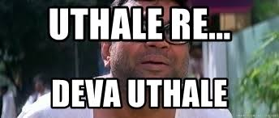

Yo folks

Been a long time since we spoke, and let’s be honest, I had been a little off color. One simple reason for that : Online classes. If there was a meme that could reflect my feelings for em the best possible way, it’d have to be this : 



But unfortunately, we’re still here, bruised but alive, and the show must go on. 

This probe is probably gonna be the last we’ll be seeing of arrays, because


And this problem is pretty much a great combo of a few important concepts we have learnt so far : 

Problem : Given an UNSORTED array, find the smallest positive integer that’s missing in the array.

Given an array A = [5, -1, 1, 2], your answer’s gon be 3. 

Be very honest with yourself : If you, even subconsciously, thought 0, you might need to give yourself a smack on the head and wake up, because


So, the naive solution isn’t impossible to think : You just sort the array, plod along chhuk chhuk chhuk, wake up when you find a positive element, and keep your eyes peeled for the first missing element.

Sorting, at its best, would take O(n log n) time, so, nah, not gonna work.

Let’s try to work out a better approach.


We need to keep track of all positive elements that have already come up, like an attendance sheet. 1? Present. 2? Present. 3??3??? GOTCHA!

Now, the best way to implement an attendance sheet is to hash them, aka, map each element with its occurrence. The first positive element that doesn’t have an occurrence is our answer. 

Mehhh

We’re too clever for hashing. Can’t we do it in O(1) space? AKA, can’t we have an attendance sheet in O(1) space?

Here’s a concept that’s commonly used in a number of problems, as a sort of space-free substitute of hashing : 

> Given an array a of positive integers from 0 to n-1, n being the size of the array, for every element a[i], > we set a[a[i]] to be negative. When we traverse through the array, if a[abs(a[i])] is negative, that means 
> that the element has been encountered before, otherwise not.

This concept is used to check for duplicates in an array.

To take an example, consider  a = [3, 1, 3, 2] . For the first 3, we set a[3] to be negative, that is, -2. For the 1, we set a[1] to be negative, that is, -1. For the next 3, we try to set a[3] to be negative. LO AND BEHOLD! a[3] is already negative, which tells us that 3 has been encountered before.

Sweet concept. How do we apply this attendance sheet concept in our original problem, which, if you still remember, was to find the smallest positive integer missing. 

You can, almost at once, capture the main problem. The concept called for ALL elements to be positive. Our array, doesn’t have all positive elements.

Hmmm

Remember how we talked about the virtually dividing the array into two, in our sorting problems? Well, why don’t we ‘virtually divide’ the array, keeping the positive elements to one side, and the negatives to the other? We only care about the positive half, so we’re effectively just kicking out the negative elements.

Now, for the positive elements, we do EXACTLY what we did above : the replacement-by-negative thing.

Our answer, the smallest positive missing element, will be the FIRST element with a positive value!

Done!

Here’s how it looks like in code : 

```
void swap(int* a, int* b) 
{ 
    int temp; 
    temp = *a; 
    *a = *b; 
    *b = temp; 
} 
  
/* Utility function that puts all  
non-positive (0 and negative) numbers on left  
side of arr[] and return count of such numbers */
int segregate(int arr[], int size) 
{ 
    int j = 0, i; 
    for (i = 0; i < size; i++) { 
        if (arr[i] <= 0) { 
            swap(&arr[i], &arr[j]); 
            j++; // increment count of non-positive integers 
        } 
    } 
  
    return j; 
} 
  
/* Find the smallest positive missing number  
in an array that contains all positive integers */
int findMissingPositive(int arr[], int size) 
{ 
    int i; 
  
    // Mark arr[i] as visited by making arr[arr[i] - 1] negative. 
    // Note that 1 is subtracted because index start 
    // from 0 and positive numbers start from 1 
    for (i = 0; i < size; i++) { 
        if (abs(arr[i]) - 1 < size && arr[abs(arr[i]) - 1] > 0) 
            arr[abs(arr[i]) - 1] = -arr[abs(arr[i]) - 1]; 
    } 
  
    // Return the first index value at which is positive 
    for (i = 0; i < size; i++) 
        if (arr[i] > 0) 
            // 1 is added because indexes start from 0 
            return i + 1; 
  
    return size + 1; 
} 
  
/* Find the smallest positive missing  
number in an array that contains  
both positive and negative integers */
int findMissing(int arr[], int size) 
{ 
    // First separate positive and negative numbers 
    int shift = segregate(arr, size); 
  
    // Shift the array and call findMissingPositive for 
    // positive part 
    return findMissingPositive(arr + shift, size - shift); 
} 
```

Code credits : [GeeksforGeeks](https://www.geeksforgeeks.org/find-the-smallest-positive-number-missing-from-an-unsorted-array/)

Time complexity? Just two single traversals, aka O(n). And since we aren’t actually dividing the array, OR using a hash, no extra data structure, aka O(1) space.

And we’re done. 

Now, note here, that while this method is cool, we’re modifying the original array, and some interviewers might ask you to suggest an approach without modifying the original array. That’d be possible if we take an extra array as the attendance sheet, instead of modifying the array itself. That’d give a SC of O(n).

To get these posts via mail, [subscribe](https://dkprobescode.substack.com/subscribe)

I am available via [LinkedIn](https://linkedin.com/in/dkp1903), [Twitter](https://twitter.com/dkp1903) or Mail(dushyant@dkprobes.tech). 


DKP

ITUS(International Talent of Ultimate Student)