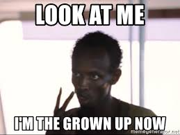
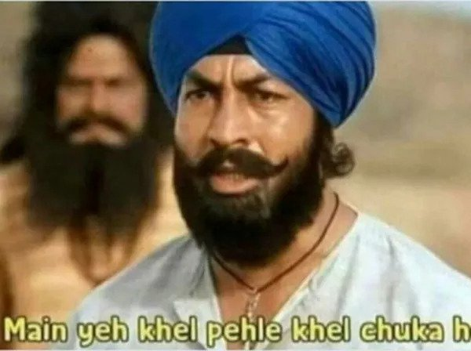
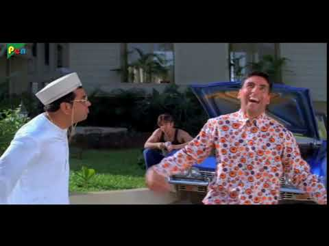

> Length of longest subarray with equal no of odd and even elements

So, for instance 

A = [1, 2, 1, 2]

would give the answer as 4, the longest subarray being the array itself.

The naive solution is simple : Make all possible subarrays, pick the longest one which satisfies.

But then,


So, naive solution ain’t good enough.

Well, it’s pretty obvious we’re gonna use Kadane. The important question is how. 

Remember, in the last post, we worked with sums? Now think, if we replace every odd element by a -1, and every even by a 1, any subarray with sum 0, will have equal number of zeroes and ones, get it? And if we store the lengths of each of these subarrays, we can just pick the maximum of these, right? 

Let’s see how it looks like in code. 

Oh, and yes, before we go in, I have used an STL data structure called `unordered_map` here. It is a special type of map, with a small difference. Whereas in a map, values are stored in increasing order, they are stored how they’re added, in an unordered_map. GeeksforGeeks has a great article on the differences here, but the essence is that when we are just counting stuff, without caring a lot about the order, as this case is, using an unordered_map gives us a little better time complexity. 

```
#define vi vector<int>
int maxSubarrayLength(vi A) 
{
    int maxLen = 0; 
    int curr_sum = 0; 
  
    unordered_map<int, int> hash; 
  
    for (int i = 0; i < A.size(); i++) { 
        if (A[i] % 2 == 0) 
            curr_sum --; 
        else
            curr_sum ++; 
  
        // Check if number of even and 
        // odd elements are equal 
        if (curr_sum == 0) 
            maxLen = max(maxLen, i + 1); 
  
        // If curr_sum already exists in map 
        // we have a subarray with 0 sum, i.e, 
        // equal number of odd and even number 
        if (hash.find(curr_sum) != hash.end()) 
            maxLen = max(maxLen, 
                        i - hash[curr_sum]); 
  
        // Store the index of the sum 
        else
            hash[curr_sum] = i; 
    } 
    return maxLen; 
} 
```

What we’re doing is, initializing a sum variable with 0, traversing every element in the array,  adding a 1 for an odd element, removing 1 for an even. If the sum comes out to be 0 anytime during the traversal, we compare the length of the present subarray with the max length so far. 

AND

We do one more thing. 

The max we calculated above, will consider ALL elements from the beginning of the array, TO the present index. Is that enough? Nope. 

Consider -> [1, 1, 1, 1, -1, -1, 1]

The sum of ANY subarray, STARTING from the first element isn’t coming out to be 0. BUT, what about the elements from 3rd position to 6th position? They’re all summing up to 0. 

THAT is ALSO a subarray. A subarray with sum 0, that is, in our case, an array with equal even and odd elements. 

Thus, to consider subarrays that DO NOT begin at the first element, we use hashing. Here comes the unordered_map.

We MAP each UNIQUE sum that we find when we’re traversing the array. And what do we hash it against? We hash it against the length of the LONGEST subarray length which gives that sum, that we’ve run into, so far.

For instance, a subarray [1, 1] gives a sum of 2. A subarray [1, -1, -1, 1, 1, 1] ALSO gives a sum of 2. So, we’ll hash the sum to the longer length, 6. How does this help? Everytime we get a sum, we check if the sum exists in the map. If it does, it means that 



That means, this sum has occurred before, meaning that, ALL elements from when the sum occurred before, TO the present index, have contributed ZERO to the sum, AKA, a subarray with 0 SUM!!

So, we compare the length of this subarray, with the max.

Wasn’t that cool?!?!?!

Time complexity? O(N). You might wonder a little here. we’re searching the sum in the map everytime. Doesn’t that take time?

Remember how we used unordered_map instead of map? Well, the good thing about the U-Map is that average TC of searching is O(1), aka constant time. As opposed to that, TC of searching in map is O(log N). So, had we used a map, the overall TC would’ve been O(N log N), as opposed to O(N) in this case. So, we’re all HAPPY.


(Oh, I miss Obama :()

I’m going to call these posts ‘probes’ from now on, keeping up with my blog name DKProbes, because we’re ‘probing’ the problem.



To get these posts via mail, subscribe [here](https://dkprobescode.substack.com/subscribe).

Until next time

DKP

ITUS(International Talent of Ultimate Student)
