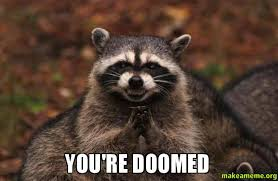

To kaise hain aap log!

In my [last probe](https://dkprobes.tech/Data-Structures/first-miss), I’d promised that we’d be finally be moving away from arrays to other, more ‘serious’ data structures. 

And what better choice, than a data structure, which is like an array with a little bit of an attitude problem?

AKA STACK. 

A stack……….is a stack. 

A stack of paper(remember the thin sheet like object we used to play cross-and-zeroes on?), a stack of bread. It’s….a stack.

You put things up one above the other. To get a thing, you first have to remove all the things on top, unless you’re magic enough to do that whipping-the-bill-from-under-the-coin-very-fast. I’ll assume you aren’t. 


Due to this property of a stack, it’s called LIFO(Last In First Out) - the element that goes in last, comes out first. The paper on the top of the stack, is the first one you can remove, without having to shift the other papers.

That’s all good for show. How does it work?

Like I said, it’s an array, with a bit of attitude. In an array, you can do a[i] to get the element at the ith position. You can’t do that in the stack. You can only add or retrieve elements from the BACK of the stack. A new element is added from the back, an element is removed from the back. To get an element that’s not the last, you HAVE to remove all elements before it.

A stack implementation usually has 3 functions - push(), pop() and top().

push() adds an element to the stack. pop() removes it. top() gets the topmost, aka last element of the stack without removing it.

You can easily see how you can implement it as an array. push() would be accomplished as a push_back() for vector. pop() by pop_back() and top() by a[-1].

In C++ STL, you 

- implement stack by including it as
```
#include<stack>
```
- Create a stack as 
```
stack<int>s
```
- And call the in-built methods as
```
s.pop(), s.push(element), s.top()
```

So, that was a short crash course on stack. 

Let’s get to our problem now. 

> Given a string of a lot of brackets, we have to check if they’re matched or not.

For instance, s = ‘[({})]’ is matched. ‘[(])’ is not. 

Naive solution? For every starting bracket, find the ending bracket. If another ending bracket comes before,



That’s a no. If we reach the end of the array, we got it!

Naive solution is…


Now, you know we’re gonna be using stack here, because that’s the title of this probe. How?

Note that we need to hang on to a bracket, UNTIL IT HAS NOT BEEN CLOSED. Once it’s closed, we don’t really care about it. 

Right?

And this ‘open-closed’ness should follow the correct order. And that’s done with the help of a stack. 

We push elements onto the stack, whenever they’re open brackets. When we run into a closed bracket, we check if the closed bracket is the correct match for the top of the stack. If it is, we pop the open bracket too, since it’s no longer of concern. If it isn’t that means we have a mismatch.

Let’s see how it looks like in code.

```
// function to check if paranthesis are balanced 
bool areParanthesisBalanced(string expr) 
{ 
    stack<char> s; 
    char x; 
  
    // Traversing the Expression 
    for (int i = 0; i < expr.length(); i++) { 
        if (expr[i] == '(' || expr[i] == '[' || expr[i] == '{') { 
            // Push the element in the stack 
            s.push(expr[i]); 
            continue; 
        } 
  
        // IF current current character is not opening 
        // bracket, then it must be closing. So stack 
        // cannot be empty at this point. 
        if (s.empty()) 
            return false; 
  
        switch (expr[i]) { 
        case ')': 
  
            // Store the top element in a 
            x = s.top(); 
            s.pop(); 
            if (x == '{' || x == '[') 
                return false; 
            break; 
  
        case '}': 
  
            // Store the top element in b 
            x = s.top(); 
            s.pop(); 
            if (x == '(' || x == '[') 
                return false; 
            break; 
  
        case ']': 
  
            // Store the top element in c 
            x = s.top(); 
            s.pop(); 
            if (x == '(' || x == '{') 
                return false; 
            break; 
        } 
    } 
  
    // Check Empty Stack 
    return (s.empty()); 
} 
```

The code is pretty self-explanatory. One potential doubt might be, why do we return s.empty()? If the brackets are indeed balanced, after we traverse the entire array, each closing bracket will have found its opening bracket, and thus, will have popped it out. So, the stack should be empty. If it isn’t, that means that there is an opening bracket that doesn’t have a closing bracket! That means the brackets are NOT balanced.

Time complexity? Easy. We’re only traversing through the entire string once, so it’s O(n). Space? O(n) too, for the stack, which, in the worst case of having all opening brackets, will hold a max of n elements. 

Hope this probe was intuitive for your understanding of the stack data structure. I’d strongly suggest that you try implementing a stack by yourself so as to get the exact idea of how it works.

Code on GitHub [here](https://github.com/dkp1903/CodeProbes/blob/master/paren-check.cpp)

To get these posts via mail, [subcribe](https://dkprobescode.substack.com/subscribe)

You can reach me via [LinkedIn](https://linkedin.com/in/dkp1903) or [Twitter](https://twitter.com/dkp1903). 

See you next week

DKP

ITUS(International Talent of Ultimate Student)