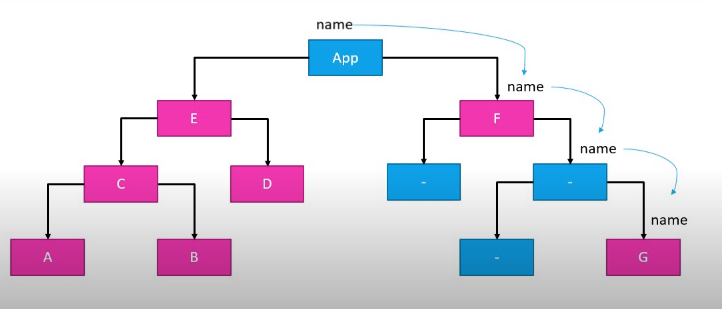

> Redux is a predictable state management library for Javascript apps.

Wait, what?

Let's take it step by step.

1. What the heck is state?

React is made in components, which are pieces of UI. Each component has its own state, which is a set of variables that determine the content that is 
rendered. For instance, the data that is being fetched in a restaurants application, the name of the user in a Header, and so on - all of these represent parts of the state.

2. How does state management work in React, without using Redux?

For the most part, React works well without using anything Redux-y. 
Every React app has a set of components, each of the components has their own state. When 
components need to share state, they do so by passing the state variables as props.

For instance

```
class ParentComponent extends React.Component {
    constructor(props) {
        super(props)
        this.state = {
            products = ['A', 'B', 'C']
        }
    }
    
render() {
    return(
        <ChildComponent products={this.state.products}>
    )
    }
}

```
The state `products` of the `ParentComponent` is shared with the `ChildComponent` via props.

3. This is fine, isn't it? Doesn't look like we need another tool for something that just works?

This is just two components, which share a parent child relationship, which allow state to be passed easily. 

A parent-child relationship is a necessity for us to share state. It's only a parent component that can share state with a child component, not vice versa. No sibling components can share components either. 

Thus, to share components between siblings, you'd need to have a common parent, transfer the state to the parent, and have the parent share the state to the siblings.

And this, when the Parent itself has no use for the state being shared.

Not exactly the best solution is it?

And that's not the worst part. What if you need to share the state with a cousin component, one that doesn't have the present ParentComponent as the parent? You need to move that state further up.




Consider the above image. If you were to share state between A and G, the only way you could do it, is to store all of A's state in the App component, pass it level by level to both A and G, even though all components apart from these two
had nothing to do with the state.

Far from the best solution.

4. Where does Redux fit in?

Redux holds a single source of truth, called the Redux store, which holds all the state for the application, and is able to pass it to the components that need it.
This removes the major drawback of having to pass along state via props.

Exactly how that happens, we'll discuss in a coming probe.

5.  Redux is not specific to React - as said before, Redux is a state management library for Javascript apps, and can work equally well with React, Angular, Vue, or even Vanilla JS apps. 
Since Angular has inbuilt state management, and Vue has a dedicated library called VueX, Redux isn't just that frequent with these.

